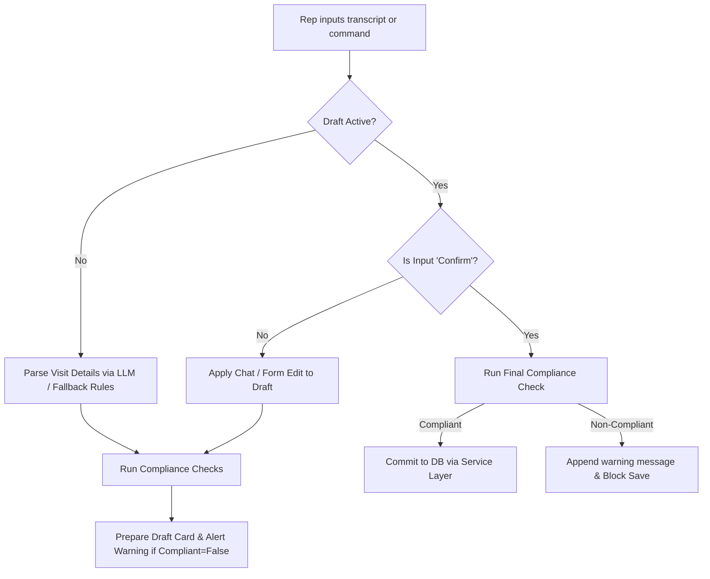

# MedicaCRM — AI-First HCP Interaction Logging & Compliance Portal

MedicaCRM is a modern, high-fidelity CRM dashboard designed for pharmaceutical and life-sciences representatives (Reps) to log clinical visits, manage drug sample distribution compliance, and track Healthcare Professional (HCP) interactions. 

The application utilizes an **AI-First hybrid approach** combining a structured programmatic form ledger with an **AI Copilot Assistant** to automate visit summaries, structure conversational transcripts, and enforce real-time regulatory compliance checks.

---

## Technical Stack

* **Backend**: FastAPI (Python), SQLAlchemy (SQLite Database), Pydantic, and LangGraph/LangChain.
* **Frontend**: React (Vite), Redux Toolkit (state management), Axios, and Vanilla CSS styled with custom HSL dark-mode aesthetics.
* **AI Model**: LLM orchestration via Groq (Gemma2-9B) with a rule-based fallback keyword extraction parser.

---

## Role of the LangGraph Agent in Managing HCP Interactions

The AI Assistant is powered by a **LangGraph state graph orchestrator** that guides the Rep through the life cycle of logging a visit. Rather than forcing Reps to manually select items from complex CRM menus, the agent handles the heavy lifting:

1. **State Persistence**: Using a conversation `thread_id` to persist dialogue states (in-memory threads store).
2. **Dynamic Intent Detection**: Resolving whether the Rep's input is a new visit log, a refinement edit to an existing draft, or a confirmation to save the draft.
3. **Structured Entity Extraction**: Mapping natural language transcripts to structured CRM models.
4. **Interactive Validation Loops**: Triggering compliance rules and prompting user review before saving.



---

## LangGraph Agent Sales Tools

The LangGraph agent uses five specific tools to execute sales-related actions and ensure compliant workflows:

### 1. Log Interaction Tool (Core Capture)
* **Purpose**: Captures conversational or written visit notes and extracts structured CRM entities.
* **Operation**: Sends the raw note to the LLM alongside metadata context of available HCPs, products, and sample lots.
* **Extraction details**:
  * **HCP Resolution**: Maps name/location to database `hcp_id`.
  * **Sample Drops**: Detects product names, distributed lots, and quantities.
  * **Sentiment Analysis**: Evaluates tone into `positive`, `neutral`, `negative`, or `objection`.
  * **Duration**: Automatically extracts meeting time in minutes.
  * **Summarization**: Generates a brief 2-3 sentence clinical summary.
  * **Standard Topics**: Maps themes discussed to standard fields: `Product Presentation`, `Efficacy Review`, `Safety Profile`, `Dosage Options`, `Competitor Comparison`, or `Sample distribution`.

### 2. Edit Interaction Tool (Modification)
* **Purpose**: Modifies the pending draft card values based on direct edits (UI checkboxes, inputs) or chat-based corrections (e.g. *"change quantity to 5"*).
* **Operation**: Updates the draft fields in the state. Each modification triggers a client-side and server-side **compliance check** in real-time, instantly updating safety warnings and locking/unlocking the confirmation button.

### 3. HCP Lookup Tool (`hcp_lookup_tool`)
* **Purpose**: Searches the medical directory database for matches on a physician's name, specialty, or clinic location.
* **Operation**: Returns details like NPI numbers, segment (e.g. KOL), preferred communication channels, and last interaction dates.

### 4. Compliance Sample Check Tool (`compliance_sample_check_tool`)
* **Purpose**: Validates drug sample distribution against FDA and company regulations before committing.
* **Operation**:
  * **Licensing check**: Checks if the physician's NPI is active and valid (minimum 10 characters).
  * **Transaction limits**: Blocks pushes where single-transaction quantities exceed **10 units** of a sample.
  * **Safety check**: Rejects distribution if the sample lot's expiration date is in the past.

### 5. Suggest Next Best Action Tool (`suggest_next_best_action_tool`)
* **Purpose**: Recommends clinical follow-up activities and timelines based on segment and interaction sentiment.
* **Operation**: 
  * If sentiment is an `objection`, it recommends scheduling a Medical Science Liaison (MSL) within 5 days.
  * If HCP is a key opinion leader (`KOL`), it recommends sharing premium efficacy studies and inviting them to an upcoming symposium within 14 days.

---

## Setup & How to Run

### Prerequisite
Ensure you have **Python 3.10+** and **Node.js 18+** installed.

### 1. Run the Backend
1. Open a terminal and navigate to the backend directory:
   ```bash
   cd backend
   ```
2. Set up the virtual environment:
   ```bash
   python -m venv venv
   # On Windows:
   venv\Scripts\activate
   # On macOS/Linux:
   source venv/bin/activate
   ```
3. Install dependencies:
   ```bash
   pip install -r requirements.txt
   ```
4. Configure your `.env` file inside the `backend/` directory:
   ```env
   GROQ_API_KEY=your_groq_api_key_here
   ```
5. Start the FastAPI server (since you are inside the `backend` directory):
   ```bash
   # If venv is activated:
   uvicorn app.main:app --host 127.0.0.1 --port 8000 --reload
   
   # Or using Windows Python launcher:
   py -m uvicorn app.main:app --host 127.0.0.1 --port 8000 --reload
   ```

   *Note: If you run uvicorn from the root workspace directory instead, use `backend.app.main:app` as the app path.*

### 2. Run the Frontend
1. Open another terminal and navigate to the frontend directory:
   ```bash
   cd frontend
   ```
2. Install dependencies:
   ```bash
   npm install
   ```
3. Start the Vite dev server:
   ```bash
   npm run dev
   ```
4. Open your browser and navigate to `http://localhost:5173/`.

---

## Contributors

* **Sreddy08840** — [GitHub Profile](https://github.com/Sreddy08840/)
